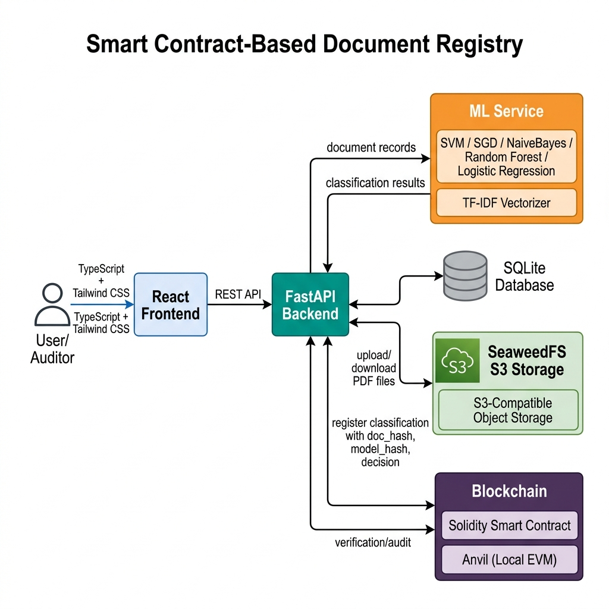
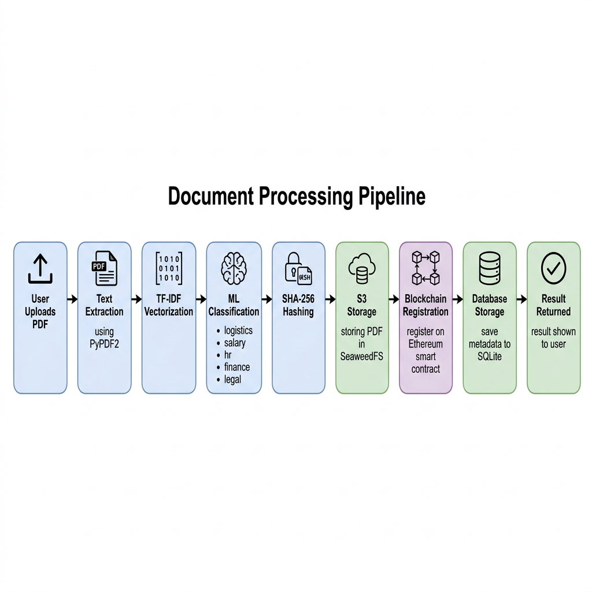

# Smart Contract-Based Document Registry

A full-stack system that combines machine learning classification with Ethereum blockchain to create an auditable document registry. Documents are automatically classified into categories, and every decision is permanently recorded on-chain — making it tamper-proof and independently verifiable.

---

## What It Does

Organizations deal with large volumes of documents daily — invoices, contracts, HR paperwork, legal agreements. Manual classification is slow and error-prone, and traditional databases offer no proof that records haven't been tampered with.

This project addresses that by:

1. **Automating classification** with 5 ML models trained on TF-IDF text features
2. **Recording every decision on the blockchain** via a Solidity smart contract
3. **Allowing independent verification** — anyone can re-upload a document and check it against the on-chain record

### Document Categories

The system classifies PDF documents into five categories: **logistics**, **salary**, **HR**, **finance**, and **legal**.

---

## Architecture

<p align="center">
  
</p>

- **Frontend** (React + TypeScript) — upload documents, browse the registry, run audits
- **Backend** (FastAPI) — handles classification, storage, blockchain interaction, and API
- **ML Service** (scikit-learn) — 5 classifiers with TF-IDF vectorization, each in 3 versions
- **Blockchain** (Solidity on Anvil) — immutable on-chain classification records
- **SeaweedFS** — S3-compatible object storage for PDF files
- **SQLite** — metadata and fast queries

---

## Workflow

<p align="center">
  
</p>

When a user uploads a PDF, the system extracts text (PyPDF2), vectorizes it with TF-IDF, classifies it using the selected ML model, computes SHA-256 hashes of both the document and the model, stores the PDF in SeaweedFS, registers the classification on the smart contract, saves metadata to SQLite, and returns the result.

---

## Tech Stack

| Layer | Technologies |
|-------|-------------|
| Frontend | React, TypeScript, Vite, Tailwind CSS, React Router |
| Backend | FastAPI, SQLAlchemy, Web3.py, PyPDF2, boto3 |
| ML | scikit-learn (SVM, Logistic Regression, Random Forest, Naive Bayes, SGD), TF-IDF |
| Blockchain | Solidity, Foundry (Forge + Anvil) |
| Storage | SQLite, SeaweedFS (S3-compatible) |
| Infra | Docker Compose, Nginx |

---

## Project Structure

```
smart-contract-registry/
├── frontend/                # React + TypeScript UI
│   └── src/
│       ├── pages/           # Upload, Documents, Audit
│       ├── components/      # Layout, ClassBadge, HashDisplay
│       └── services/        # API client
├── backend/                 # FastAPI server
│   └── app/
│       ├── api/routes.py    # 12 REST endpoints
│       ├── core/            # Config, database
│       ├── models/          # ORM model
│       └── services/        # Blockchain, ML, S3 services
├── contracts/               # Foundry / Solidity
│   ├── src/DocumentRegistry.sol
│   └── test/DocumentRegistryTest.t.sol
├── ml_model/                # Training script + serialized models
├── data/                    # 500 synthetic PDFs (100 per class)
└── docker-compose.yml       # SeaweedFS
```

---

## Getting Started

### Setup

**1. Start SeaweedFS**

```bash
docker-compose up -d
```

**2. Start the local blockchain**

```bash
anvil
```

**3. Deploy the smart contract**

```bash
cd contracts
forge install && forge build
forge script script/DeployDocumentRegistry.s.sol:DeployDocumentRegistry \
  --rpc-url http://localhost:8545 \
  --private-key 0xac0974bec39a17e36ba4a6b4d238ff944bacb478cbed5efcae784d7bf4f2ff80 \
  --broadcast
```

Update the deployed address in `backend/.env` if it differs from the default.

**4. Generate training data and train models**

```bash
cd data
pip install faker reportlab
python generate_documents.py

cd ../ml_model
pip install scikit-learn pandas joblib PyPDF2
python train_model.py
```

**5. Start the backend**

```bash
cd backend
pip install fastapi uvicorn sqlalchemy aiosqlite web3 PyPDF2 joblib scikit-learn boto3 pydantic-settings
uvicorn app.main:app --reload --port 8000
```

**6. Start the frontend**

```bash
cd frontend
npm install
npm run dev
```

The UI runs at `http://localhost:5173`, backend API at `http://localhost:8000`.

---

## Smart Contract

`DocumentRegistry.sol` stores classification records on-chain. Each record contains:

- `docHash` (bytes32) — SHA-256 hash of the PDF
- `modelHash` (bytes32) — SHA-256 hash of the ML model
- `decision` (enum) — one of LOGISTICS, SALARY, FINANCE, LEGAL, HR
- `timestamp` — block timestamp
- `uploader` — Ethereum address that registered the document

The contract prevents duplicate registrations and emits a `ClassificationRegistered` event on every new entry. It includes 11 unit tests and a fuzz test, runnable with `forge test -vv`.

---

## ML Models

Five classifiers are trained on 500 synthetic PDF documents (100 per class), each in 3 versions with different train/test splits:

| Model | Algorithm |
|-------|-----------|
| SVM | Linear SVC |
| Logistic Regression | max_iter=1000 |
| Random Forest | 100 estimators |
| Naive Bayes | Multinomial with Laplace smoothing |
| SGD | Hinge loss, L2 penalty |

Text is vectorized using TF-IDF with 5000 features, unigrams + bigrams, English stop words removed. Each model is saved as a `.pkl` bundle containing both the trained model and its fitted vectorizer, along with a SHA-256 hash for integrity verification.

---

## API Endpoints

| Method | Endpoint | Description |
|--------|----------|-------------|
| POST | `/api/documents/upload` | Upload and classify a PDF |
| GET | `/api/documents/` | List all documents |
| GET | `/api/documents/{id}` | Get document by ID |
| GET | `/api/documents/{id}/file` | Download stored PDF |
| GET | `/api/documents/hash/{hash}` | Look up by SHA-256 hash |
| POST | `/api/audit/verify` | Re-upload PDF for verification |
| GET | `/api/audit/{hash}` | Audit document (DB vs blockchain) |
| GET | `/api/audit/stats/summary` | Registry statistics |
| GET | `/api/models` | List available ML models |
| GET | `/health` | Health check |

---

## Verification

The system supports two audit modes:

**File re-upload** — an auditor uploads a PDF, and the system re-classifies it using the same model version, recomputes all hashes, and compares against the on-chain record. If the document hash, model hash, and classification all match, the document is verified as authentic. Any mismatch signals tampering.

**Hash-based audit** — enter a document hash to compare the database record against the blockchain record, checking whether the off-chain data is consistent with the immutable on-chain data.

---


